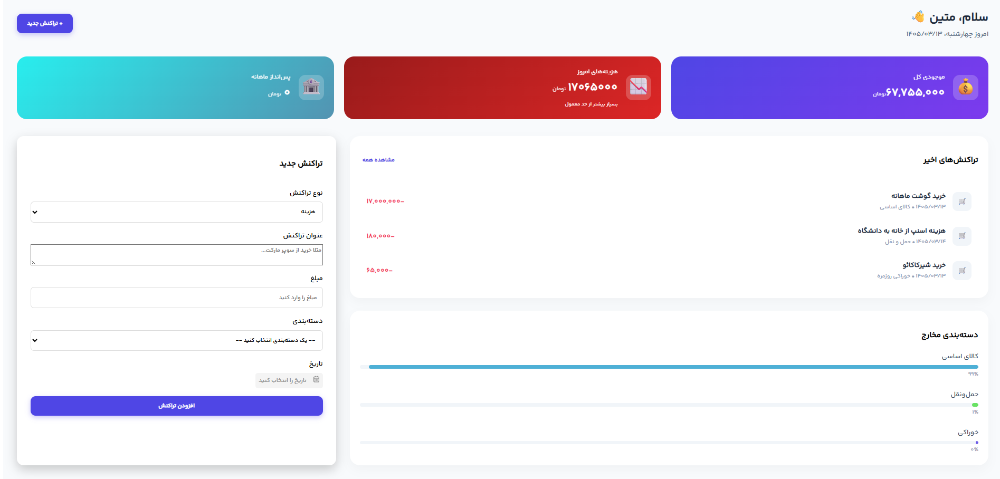

# Tracker

Tracker is a personal finance management application built with React, TypeScript, and Redux Toolkit.  
It helps you track daily income and expenses, calculate balances, and get a clear overview of your financial situation.

---

## 📸 Preview

<<<<<<< HEAD
> Add a screenshot of the app here
=======
>>>>>>> 07a1e995760ac212b6326834859205b3d2a40b2b



---

## ✨ Features

- Add income and expense transactions
- Separate tracking of income and expenses
- Automatic calculation of daily balance
- Overview of total income and total expenses
- Simple and clean UI
- State management with Redux Toolkit

---

## 🧠 Purpose of the Project

This project was built mainly for learning and practice:

- React component architecture
- Redux Toolkit state management
- TypeScript in real-world projects
- Managing financial logic in frontend apps

---

## 🛠️ Tech Stack

- React
- TypeScript
- Redux Toolkit
- JavaScript (ES6+)
- HTML / CSS

---

## 🚀 Getting Started

Clone the repository:

```bash
<<<<<<< HEAD
git clone https://github.com/matinroghani/Tracker.git
=======
git clone https://github.com/matinroghani/Tracker.git
>>>>>>> 07a1e995760ac212b6326834859205b3d2a40b2b
